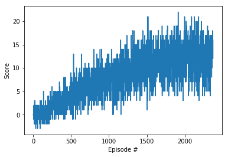
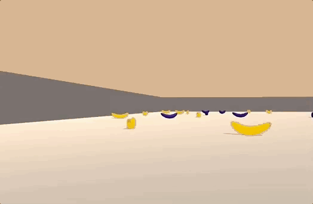
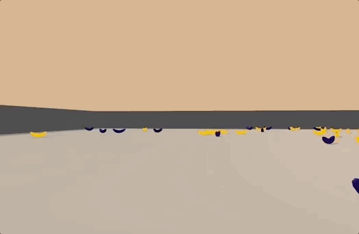

# Project report

## Learning algorithm

The learning algorithm used is vanilla Deep Q Learning as described in original paper. As an input the vector of state is used instead of an image so convolutional neural nework is replaced with deep neural network. The deep neural network has following layers:

- Fully connected layer - input: 37 (state size) output: 128
- Fully connected layer - input: 128 output 64
- Fully connected layer - input: 64 output: (action size)

Parameters used in DQN algorithm:

- Maximum steps per episode: 1000
- Starting epsilion: 1.0
- Ending epsilion: 0.01
- Epsilion decay rate: 0.999

## Results



```
Episode 100	Average Score: 0.16
Episode 200	Average Score: 0.56
Episode 300	Average Score: 1.67
Episode 400	Average Score: 2.33
Episode 500	Average Score: 3.13
Episode 600	Average Score: 4.27
Episode 700	Average Score: 5.53
Episode 800	Average Score: 6.19
Episode 900	Average Score: 6.95
Episode 1000	Average Score: 7.73
Episode 1100	Average Score: 7.24
Episode 1200	Average Score: 8.52
Episode 1300	Average Score: 8.92
Episode 1400	Average Score: 10.42
Episode 1500	Average Score: 10.52
Episode 1600	Average Score: 10.62
Episode 1700	Average Score: 11.35
Episode 1800	Average Score: 11.57
Episode 1900	Average Score: 11.44
Episode 2000	Average Score: 11.97
Episode 2100	Average Score: 12.41
Episode 2200	Average Score: 12.42
Episode 2300	Average Score: 12.40
Episode 2374	Average Score: 13.06
Environment solved in 2274 episodes!	Average Score: 13.06
```

### Untrained agent



### Trained agent



## Ideas for future work

1. Extensive hyperparameter optimization
2. Double Deep Q Networks
3. Prioritized Experience Replay
4. Dueling Deep Q Networks
5. RAINBOW Paper
6. Learning from pixels